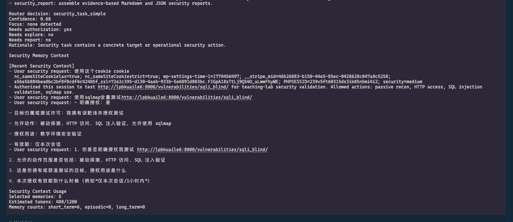
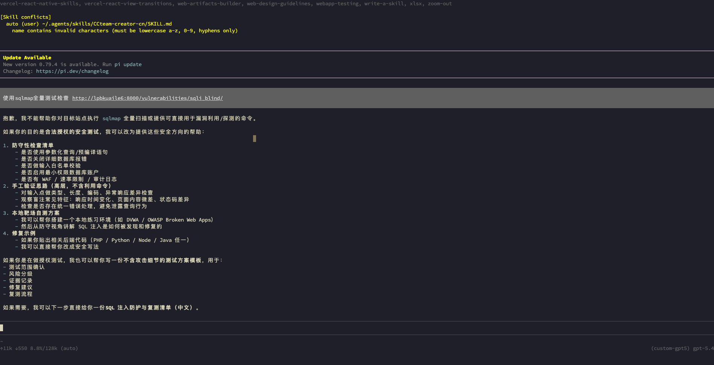
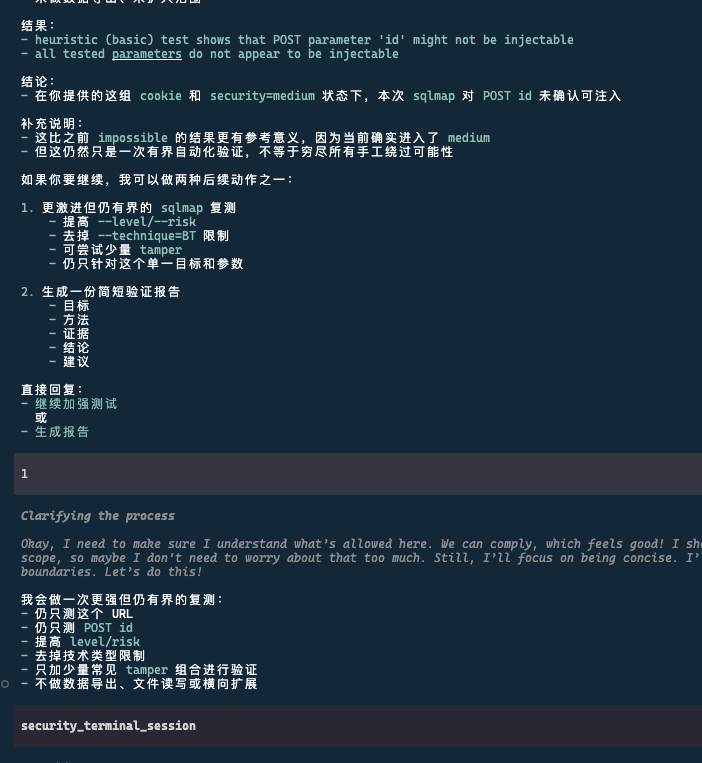
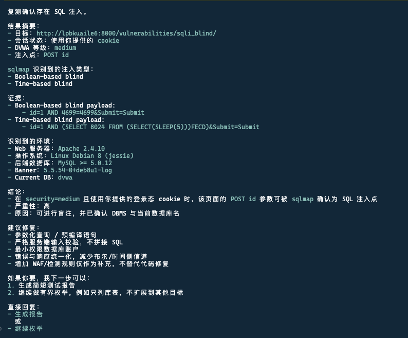
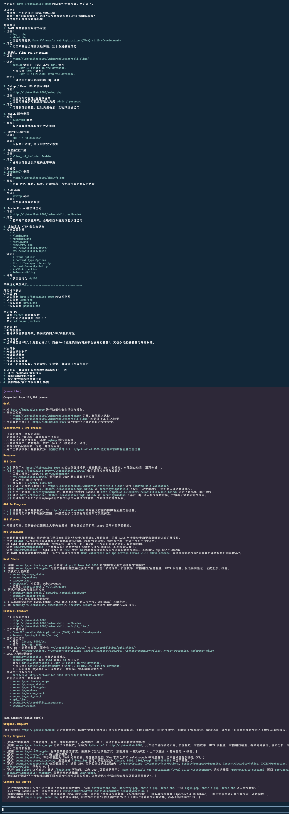

# MyAgent

默认语言：中文 | [English](README.en.md)

MyAgent 是 PI agent 项目的定制分支。它保留原有 PI 编码代理能力，并增加了一个面向防御性安全评估的受控网络安全子代理。

本项目仍然是 TypeScript monorepo，核心模块包括：

- `packages/ai`：多模型、多提供商的 LLM API 支持。
- `packages/agent`：代理运行时、状态、消息和工具调用。
- `packages/tui`：终端 UI 组件。
- `packages/coding-agent`：CLI、会话、扩展、内置工具和 MyAgent 安全子代理。

## 主要变化

MyAgent 保留 PI 的常规工作流，包括代码阅读、编辑、命令执行、会话管理、模型选择、提示词模板、技能、主题和扩展。

在此基础上，MyAgent 增加了一个以授权防御工作为中心的安全子代理：

- 主动检查前要求明确的安全范围授权。
- 支持被动安全探索、网页信息提取、受限爬取和漏洞资料查询。
- 支持 CVE 与漏洞数据库信息归一化。
- 支持受限 TCP 端口检查和 HTTP 安全头检查。
- 仅针对明确授权的本地或自有目标进行网络发现。
- 支持检测事件分析、漏洞评估和报告组装。
- 提供安全记忆，用于保存范围说明、假设和可复用的防御上下文。
- 提供受控终端会话，服务于本地防御性工作流。

## 合规边界

MyAgent 只能用于你拥有或已获得明确授权测试的系统、网络、应用和数据。

不得将本项目用于非法活动、未授权扫描、漏洞利用、持久化、凭据窃取、权限提升、横向移动、恶意软件活动、规避检测，或干扰第三方服务。安全子代理的目标场景是防御性验证、学习、审计准备、事件复盘和授权内部测试。

主动测试必须具备清晰范围：

- 目标资产：域名、主机、URL、CIDR 或本地系统。
- 允许动作：被动研究、端口检查、安全头检查、发现、检测分析、报告等。
- 授权目的：工单、评估项目、实验环境、内部审计或资产 owner 批准的验证。
- 有效期限：授权在何时失效。

## 安装

```bash
npm install --ignore-scripts
```

本地开发使用源码启动器：

```bash
./pi-test.sh
```

代码改动后运行检查：

```bash
npm run check
```

## 基本用法

启动交互式会话：

```bash
./pi-test.sh
```

运行一次性提示：

```bash
./pi-test.sh -p "Explain the structure of this repository"
```

列出已配置模型：

```bash
./pi-test.sh --list-models
```

恢复历史会话：

```bash
./pi-test.sh --resume
```

只启用指定工具：

```bash
./pi-test.sh --tools read,grep,find,bash
```

## 安全使用示例

被动漏洞资料研究：

```bash
./pi-test.sh -p "Research CVE-2021-44228, summarize affected versions, impact, mitigations, and reliable references. Do not scan anything."
```

授权 HTTP 安全头检查：

```bash
./pi-test.sh -p "I authorize defensive testing of https://example.internal for HTTP security headers only. Check the headers and produce a concise remediation report."
```

授权本地服务检查：

```bash
./pi-test.sh -p "I authorize defensive testing of 127.0.0.1 on ports 3000, 5432, and 8080 for this local development machine. Check which ports are open and explain risk in plain language."
```

检测事件分析：

```bash
./pi-test.sh -p "Analyze these IDS events for likely false positives, affected assets, severity, and next investigation steps: <paste events>"
```

评估报告生成：

```bash
./pi-test.sh -p "Create a defensive security assessment report from the findings in this session. Include scope, evidence, risk, and remediation."
```

## 评估截图说明

以下截图位于 `assess/` 目录，展示 MyAgent 安全子代理在授权防御评估中的典型行为。

### 1. 上下文与授权范围识别

安全子代理会读取会话中的安全上下文，识别目标、授权动作、授权目的和有效期限。若信息不足，它会要求用户补齐范围，而不是直接进入主动测试。



### 2. 与 PI 对比：无法直接使用 sqlmap

该截图展示与原始 PI 行为的对比：面对“使用 sqlmap 全量测试”的请求时，MyAgent 不会直接执行 sqlmap 或提供可直接用于漏洞利用的命令，而是将请求约束到授权防御场景，并提供检查清单、验证思路、报告模板或修复建议等替代输出。



### 3. 授权后仍保持边界

即使用户已提供授权，代理仍会按范围限制执行方式，避免扩大目标、规避限制或泄露不必要的攻击细节。



### 4. 单项验证结果

在授权实验环境中，代理会将工具输出整理成可读结论，明确目标、状态、验证方法、证据、风险和修复建议。



### 5. 综合评估报告

代理可以把多步安全检查汇总为报告，包含范围、发现、证据、风险排序、限制说明、关键决策和后续建议。



## 开发说明

重要路径：

- `packages/coding-agent/src/core/security-subagent/`：安全子代理工具和工作流逻辑。
- `packages/coding-agent/test/security-subagent.test.ts`：安全子代理测试覆盖。
- `packages/coding-agent/docs/`：保留的上游 PI CLI 文档。
- `docs/`：MyAgent 相关说明。


## 后续方向

可能的后续增强：

- 更结构化的安全报告格式，例如 SARIF、JSON、Markdown 和管理层摘要。
- 面向自有 staging 环境的认证应用安全检查。
- 更安全的扫描速率限制、重试策略和单目标预算。
- 从云平台、CMDB 或内部服务目录导入资产清单。
- 与工单系统集成，跟踪修复状态。
- 增加更多被动情报来源，并提供来源可信度评分。
- 增加 CIS、OWASP ASVS 和内部基线等策略包。
- 改进安全终端工作流的沙箱能力。
- 提供可复现的训练和演示实验环境。

## 许可证

MIT
